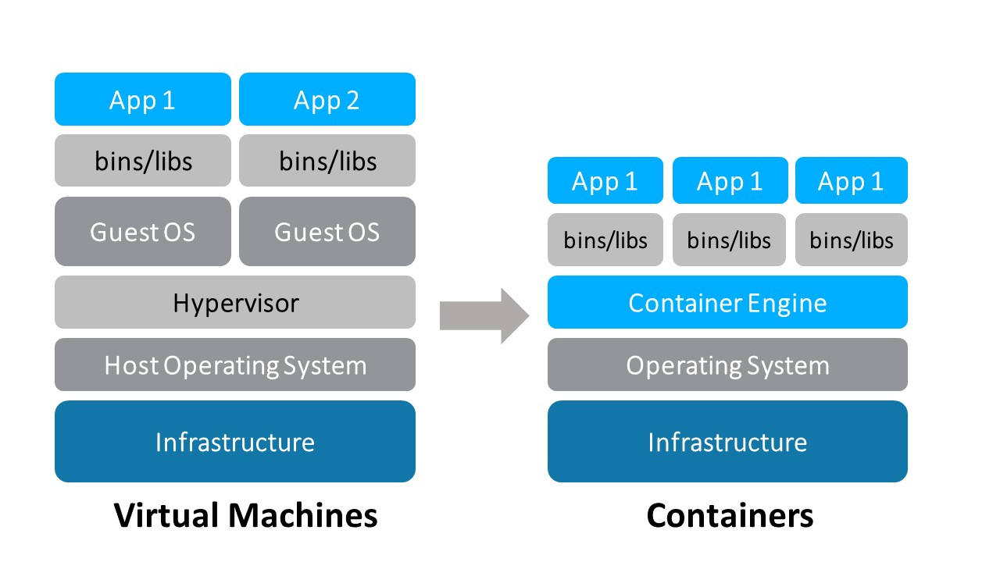

# Mergulhando no Docker

## Conceitos de Docker e Virtualização

Docker é uma plataforma para desenvolvedores e administradores de sistemas que desejam **desenvolver, 
implantar e executar** aplicações com contêineres. 
O uso de contêineres Linux para implantar aplicativos é chamado de _containerização_ ou do inglês _containerization_.
Os Containers não são novos, mas seu uso para implantação de aplicações tem sido amplamente explorado.

A containerização de aplicações tem se tornado cada vez mais comum porque os contêineres são:

- Flexível: mesmo as aplicações mais complexas podem ser contêineras.
- Leve: os recipientes alavancam e compartilham o kernel do host.
- Permutável: você pode implantar atualizações e atualizações on-the-fly.
- Portátil: você pode construir localmente, implantar na nuvem e executar em qualquer lugar.
- Escalável: você pode aumentar e distribuir automaticamente réplicas de contêiner.
- Empilhável: você pode empilhar serviços verticalmente e on-the-fly.


### Imagens e Containers

Uma **imagem** é um pacote executável que inclui todos os recursos necessários para executar uma aplicação (incluindo
o código, suas bibliotecas, variáveis de ambiente e arquivos de configuração).

Um **contêiner** é uma instância em tempo de execução de uma imagem (ou seja, uma imagem com estado ou um processo de usuário). 
Você pode ver uma lista de seus contêineres em execução com o comando `docker ps`.

### Containers e Máquinas virtuais

Um **container** é executado nativamente no *SO* e compartilha o kernel da máquina host com outros containers. 
Ele executa um processo discretamente, não tendo mais recursos(por exemplo,memória) do que qualquer outro processo, tornando-o leve.

Em contrapartida, uma **máquina virtual** (VM) executa um sistema operacional "convidado" com o acesso virtual aos recursos do host através de um hypervisor. No geral, as VMs fornecem um ambiente com mais recursos do que a maioria das aplicações precisam.



## Comandos para começar a trabalhar com Doker

## Docker run

Vamos testar o comando **docker run** com a imagem oficial do Jenkins

```bash
$ docker run -p 8080:8080 -p 5000:5000 jenkins
```

O comando acima usa o seguinte:

**-run** Parâmetro para indicar qual porta será usada

**-p** Parâmetro para indicar qual porta será usada

**-jenkins** Nome da imagem que será usado para construir nosso contêiner. Essa imagem será pesquisada localmente e, se não for encontrada, o Docker tentará pesquisar no repositório do Docker

Um contêiner será criado com algum nome aleatório, como  **high_jhdm** no meu exemplo. É difícil trabalhar com nomes aleatórios, mas podemos alterá-lo da seguinte maneira:

```bash
$ docker run --name my-jenkins -p 8080:8080 -p 5000:5000 jenkins
```
Agora nosso contêiner foi criado com o nome **my-jenkins**

Note-se que, quando executamos o nosso contêiner, somos levados para dentro do contêiner, mas podemos executar em modo **daemon**  , usando o parâmetro **-d** como:

```bash
$ docker run --name my-jenkins -d -p 8080:8080 -p 5000:5000 jenkins
```
## Docker exec

Depois de criar o nosso container Jenkins, precisamos entrar dentro dele. Nós usamos o comando **docker exec** da seguinte maneira:

```bash
$ docker exec -i -t my-jenkins /bin/bash
```

## Como iniciar e parar contêineres

Iniciando
```
docker container start my-jenkins
```

Parando
```
docker container stop my-jenkins
```

Reiniciando
```
docker container restart my-jenkins
```

Pausando
```
docker container pause my-jenkins
```

Removendo a pausa
```
docker container unpause my-jenkins
```

Bloqueando um Container

```
docker container wait my-jenkins
```
Conectando a um contêiner existente
```
docker container attach my-jenkins
```

## Montando um volume

```bash
docker run 
	--name myjenkins 
	-p 8080:8080 -p 5000:5000 
	-v /var/jenkins_home:/var/jenkins_home jenkins
```

## Comandos úteis do Docker

Usado para mostrar todos os contêineres do docker  ordenados pela coluna **created**

```bash
$ docker ps -a | grep "weeks ago" | awk '{print $1}'
```
Exibindo todos os contêineres que coincidem com o status **Exited**

```bash
$ docker ps -a | grep "Exited" | awk '{print $4}'
```
Observe que ```bash {print $1}``` está combinado com a Coluna de Status

Removendo todos os containers finalizados ( **Exited** )

```bash
$ docker rm ${docker ps -a | grep "Exited" | awk '{print $1}'}
```
Imprimir todos os IDs dos contêineres

```bash
$ docker ps -qa
```

Removendo todos os containeres

```bash
$ docker rm $(docker ps -qa)
```
Mas atenção: percebam que, se o container estiver em execução, não é possível finaliza-lo. Será exibida uma msg de Conflito.

Removendo todos os containeres ignorando seu status e ignorando o erro mencionado acima.

```bash
$ docker rm --force $(docker ps -qa)
```

## Concedendo o Controle Docker a Usuários não-root

- O Docker precisa criar namespaces
- Docker precisa criar cgroups
- Docker precisa fazer um *bind* para */var/run/docker.sock*

Este é um aviso para adicionar Usuários ao Docker Group
- Control which user accounts are members of this group
- Regularly audit membership of the Docker Group

Podemos mostrar todos os grupos digitando

```bash
$ cat /etc/groups
```
Nos mostrará algo como

```bash
_launchservicesd:*:239:
_iconservices:*:240:
_distnote:*:241:
_nsurlsessiond:*:242:
_nsurlstoraged:*:243:
_displaypolicyd:*:244:
_astris:*:245:
com.apple.access_disabled:*:396:
com.apple.access_sessionkey:*:397:
com.apple.access_screensharing:*:398:
com.apple.access_ssh:*:399:
.
.
.
docker:x:112
```
Para adicionar um usuário ao Docker Group, devemos digitar:

```bash
$ sudo gpasswd -a gama docker
```

Agora, podemos ver o usuário adicionado no Docker Group

```bash
$ cat /etc/groups
.
.
.
docker:x:112:gama
```


### Docker Images

Para puxar uma Docker Image, podemos digitar:

```bash
$ docker pull ubuntu
```
O comando acima puxará a versão mais recente, mas podemos estabelecer uma específica, como:

```bash
$ docker pull ubuntu:16.04
```

Nós também podemos puxar a imagem e executar o seu container no mesmo comando, por exemplo:

```bash
$ docker run -it fedora /bin/bash
```

Observe que o Docker irá puxar apenas a versão mais recente. Podemos tirar as versões da imagem usando o comando:

```bash
$ docker pull -a fedora
```
As imagens são armazenadas localmente no diretório **/var/lib/docker/<storage driver>**.Se você estiver no Linux, acesse **/var/lib/docker/aufs** 
	
	
	
### Outros comandos docker e suas descrições:
* docker attach  – Acessar dentro do container e trabalhar a partir dele.
* docker build   – A partir de instruções de um arquivo Dockerfile eu possa criar uma imagem.
* docker commit  – Cria uma imagem a partir de um container.
* docker cp      – Copia arquivos ou diretórios do container para o host.
* docker create  – Cria um novo container.
* docker diff    – Exibe as alterações feitas no filesystem do container.
* docker events  – Exibe os eventos do container em tempo real.
* docker exec    – Executa uma instrução dentro do container que está rodando sem precisar atachar nele.
* docker export  – Exporta um container para um arquivo .tar.
* docker history – Exibe o histórico de comandos que foram executados dentro do container.
* docker images  – Lista as imagens disponíveis no host.
* docker import  – Importa uma imagem .tar para o host.
* docker info    – Exibe as informações sobre o host.
* docker inspect – Exibe r o json com todas as configurações do container.
* docker kill    – Da Poweroff no container.
* docker load    – Carrega a imagem de um arquivo .tar.
* docker login   – Registra ou faz o login em um servidor de registry.
* docker logout  – Faz o logout de um servidor de registry.
* docker logs    – Exibe os logs de um container.
* docker port    – Abre uma porta do host e do container.
* docker network – Gerenciamento das redes do Docker.
* docker node    – Gerenciamento dos nodes do Docker Swarm.
* docker pause   – Pausa o container.
* docker port    – Lista as portas mapeadas de um container.
* docker ps      – Lista todos os containers.
* docker pull    – Faz o pull de uma imagem a partir de um servidor de registry.
* docker push    – Faz o push de uma imagem a partir de um servidor de registry.
* docker rename  – Renomeia um container existente.
* docker restart – Restarta um container que está rodando ou parado.
* docker rm      – Remove um ou mais containeres.
* docker rmi     – Remove uma ou mais imagens.
* docker run     – Executa um comando em um novo container.
* docker save    – Salva a imagem em um arquivo .tar.
* docker search  – Procura por uma imagem no Docker Hub.
* docker service – Gernciamento dos serviços do Docker.
* docker start   – Inicia um container que esteja parado.
* docker stats   – Exibe informações de uso de CPU, memória e rede.
* docker stop    – Para um container que esteja rodando.
* docker swarm   – Clusterização das aplicações em uma orquestração de várias containers, aplicações junto.
* docker tag     – Coloca tag em uma imagem para o repositorio.
* docker top     – Exibe os processos rodando em um container.
* docker unpause – Inicia um container que está em pause.
* docker update  – Atualiza a configuração de um ou mais containers.
* docker version – Exibe as versões de API, Client e Server do host.
* docker volume  – Gerenciamento dos volumes no Docker.
* docker wait    – Aguarda o retorno da execução de um container para iniciar esse container.
